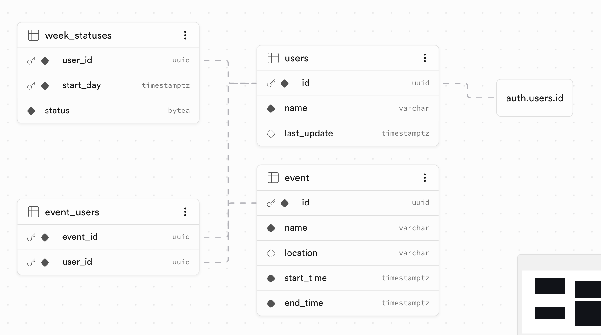

RESPONSE 2:
Here’s the Supabase-optimized version of your schema with key enhancements for security, UUID best practices, and automatic timestamp management:

-- Enable required extensions (Supabase default)
CREATE EXTENSION IF NOT EXISTS "pgcrypto";
CREATE EXTENSION IF NOT EXISTS "uuid-ossp";

-- Create USERS table (linked to Supabase Auth)
CREATE TABLE public.users (
id UUID PRIMARY KEY DEFAULT uuid_generate_v4() REFERENCES auth.users(id) ON DELETE CASCADE,
name VARCHAR(100) NOT NULL,
last_update TIMESTAMPTZ DEFAULT NOW()
);

-- Auto-update last_update trigger
CREATE OR REPLACE FUNCTION update_last_update()
RETURNS TRIGGER AS $$
BEGIN
NEW.last_update = NOW();
RETURN NEW;
END;

$$
LANGUAGE plpgsql;

CREATE TRIGGER update_users_last_update
BEFORE UPDATE ON public.users
FOR EACH ROW
EXECUTE FUNCTION update_last_update();

-- Enable Row Level Security (RLS) - Supabase requirement
ALTER TABLE public.users ENABLE ROW LEVEL SECURITY;

-- WEEK_STATUSES table
CREATE TABLE public.week_statuses (
    user_id UUID NOT NULL REFERENCES public.users(id) ON DELETE CASCADE,
    start_day TIMESTAMPTZ NOT NULL,
    status BYTEA NOT NULL CHECK (octet_length(status) = 336),
    PRIMARY KEY (user_id, start_day)
);

ALTER TABLE public.week_statuses ENABLE ROW LEVEL SECURITY;

-- EVENT table
CREATE TABLE public.event (
    id UUID PRIMARY KEY DEFAULT uuid_generate_v4(),
    name VARCHAR(100) NOT NULL,
    location VARCHAR(100),
    start_time TIMESTAMPTZ NOT NULL,
    end_time TIMESTAMPTZ NOT NULL,
    CHECK (end_time > start_time)
);

ALTER TABLE public.event ENABLE ROW LEVEL SECURITY;

-- EVENT_USERS junction table
CREATE TABLE public.event_users (
    event_id UUID NOT NULL REFERENCES public.event(id) ON DELETE CASCADE,
    user_id UUID NOT NULL REFERENCES public.users(id) ON DELETE CASCADE,
    PRIMARY KEY (event_id, user_id)
);

ALTER TABLE public.event_users ENABLE ROW LEVEL SECURITY;

-- Optional: Basic RLS policies (customize for your app)
CREATE POLICY "Users can view their own data" ON public.users
    FOR SELECT USING (auth.uid() = id);

CREATE POLICY "Users can update their own data" ON public.users
    FOR UPDATE USING (auth.uid() = id);

CREATE POLICY "Users can manage their week statuses" ON public.week_statuses
    FOR ALL USING (auth.uid() = user_id);

CREATE POLICY "Events are viewable by all" ON public.event
    FOR SELECT USING (true);

CREATE POLICY "Event assignments are user-specific" ON public.event_users
    FOR ALL USING (auth.uid() = user_id);
$$

Source Excerpt/Output:

Success. No rows returned
